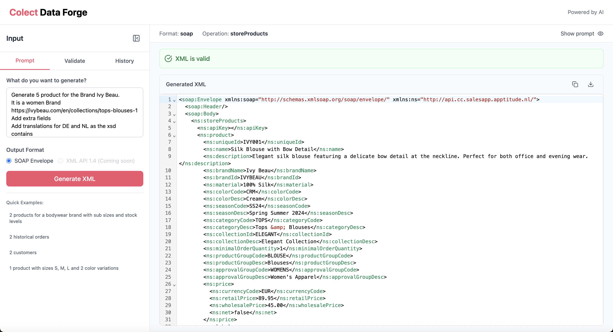
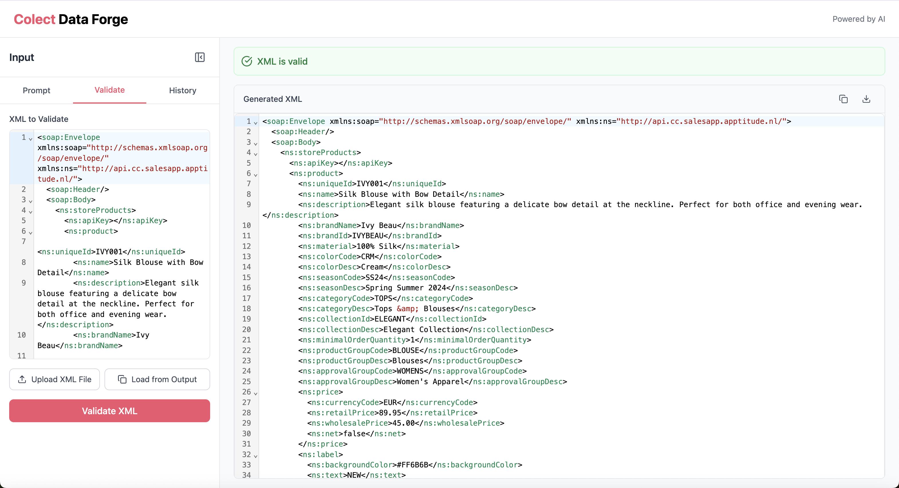
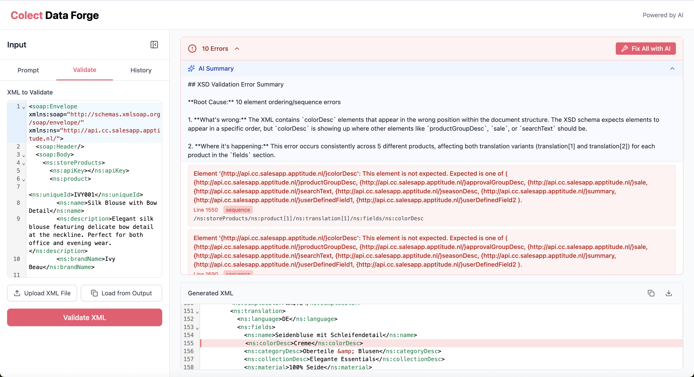
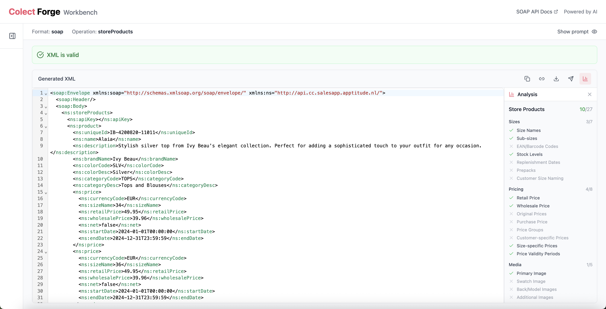

# Colect Forge Workbench

Colect Forge Workbench is an AI-powered tool for generating, validating, and testing SOAP XML requests. Part of the Colect Forge platform, the Workbench helps you learn the API, create test data, and debug your integration.


**Access the tool:** [Colect Forge Workbench](https://colect-xml-generator-app-xr8n8.ondigitalocean.app/)



**Access Restriction:** This tool is only available to users with a **Company Admin** role (users who have backend access to Colect).


---

## Features

| Feature | Description |
|---------|-------------|
| **XML Generator** | Generate valid SOAP XML examples using natural language prompts |
| **URL Extraction** | Include product URLs in prompts to auto-fetch names, details, and images |
| **Generation Settings** | Select specific features per operation before generating |
| **XML Validator** | Validate your XML against the official XSD schema |
| **AI Error Fixing** | Automatically fix validation errors with AI assistance |
| **AI Error Summaries** | Get human-readable explanations of cryptic XSD errors |
| **Analysis Panel** | See how complete your XML is with ~45 tracked features |
| **Send to API** | Send validated requests directly to the Colect API endpoint |
| **History** | View your previous generations and validations (IP-based) |

---

## XML Generator (Prompt Tab)

Generate SOAP XML examples by describing what you need in plain English. The AI understands all Colect SOAP API operations.

<figure><figcaption>XML Generator showing the prompt interface with operation selector and generated output</figcaption></figure>

### Supported Operations

| Operation | Description | Data Type |
|-----------|-------------|-----------|
| `storeProducts` | Add/update products incrementally | Products |
| `storeFullProductSet` | Replace entire product catalog | Products |
| `storeCustomers` | Add/update customers incrementally | Customers |
| `storeFullCustomerSet` | Replace entire customer database | Customers |
| `storeHistoricalOrders` | Store order history | Historical Orders |
| `storeFullHistoricalOrderSetForCustomer` | Replace all orders for a customer | Historical Orders |
| `updatePrices` | Bulk price updates | Prices |
| `updateStock` | Bulk stock updates | Stock |

### How to Use

1. Select the **Prompt** tab
2. Choose the **Operation** (e.g., `storeProducts`, `storeCustomers`)
3. Describe what you want to generate in the prompt field
4. Click **Generate XML**
5. Copy or download the generated XML

### Examples of Prompts

```
Generate 5 products for the Brand Ivy Beau.
It is a women Brand
https://ivybeau.com/en/collections/tops-blouses-1
Add extra fields
Add translations for DE and NL as the xsd contains
```

```
Create a storeCustomers request for a Dutch fashion boutique
with 2 shipping locations and VIP discount group
```

```
Create storeHistoricalOrders with 2 orders containing
3 order lines each, including shipment tracking URLs
```

### Quick Examples

The tool provides quick example buttons for common scenarios:
- Products for a bodywear brand with sub sizes and stock levels
- Historical orders
- Customers
- Products with sizes S, M, L and color variations

### URL Extraction

Include product page URLs in your prompt, and the AI will automatically fetch and extract:
- Product names and descriptions
- Image URLs
- Other product details from the page

When a URL is detected, you'll see a notification: **"URL detected - will fetch and extract product data"**

---

## Generation Settings

Click the settings icon to open the Generation Settings modal, where you can select exactly which features to include in your generated XML.

<figure><figcaption>Generation Settings modal with operation selector and feature checkboxes</figcaption></figure>

Use **All** or **None** buttons to quickly select or deselect all options in a category.

### Product Operations (27 features)



| Feature | Description |
|---------|-------------|
| Size Names | Basic size identifiers (S, M, L, 38, etc.) |
| Sub-sizes | Secondary dimension (e.g., length for jeans) |
| EAN/Barcode Codes | Product barcodes at size level |
| Stock Levels | Inventory quantities |
| Replenishment Dates | Expected back-in-stock dates |
| Prepacks | Multi-size box configurations |
| Customer Size Naming | Customer-specific size labels |



| Feature | Description |
|---------|-------------|
| Retail Price | Suggested retail price |
| Wholesale Price | B2B/wholesale price |
| Original Prices | Pre-discount prices |
| Purchase Price | Cost/purchase price |
| Price Groups | Tier-based pricing |
| Customer-specific Prices | Individual pricing per customer |
| Size-specific Prices | Different prices per size |
| Price Validity Periods | Time-limited prices |



| Feature | Description |
|---------|-------------|
| Primary Image | Main product image |
| Swatch Image | Color swatch thumbnail |
| Back/Model Images | Back, model, left, right images |
| Additional Images | Extra product photos (1-5) |
| Product Videos | Video content |



| Feature | Description |
|---------|-------------|
| Delivery Windows | Delivery drops with dates |
| Labels | Visual product badges |
| Extra Fields | Custom data fields |
| Translations | Multi-language support |
| Minimum Quantities | Min order quantity |
| Discount Groups | Discount tier assignments |
| Product Dates | Visibility date ranges |



### Customer Operations (10 features)



| Feature | Description |
|---------|-------------|
| Address Fields | Full address details |
| Currency & Language | Localization settings |
| Price Groups | Active price tiers |
| Order Limits | Min/max order values |



| Feature | Description |
|---------|-------------|
| Shipping Locations | Multiple delivery addresses |
| Contacts | Contact persons with roles |
| Agreements | Special terms & pricing |
| Discount Groups | Auto discount configs |
| Margin Groups | Margin-based pricing |
| Tags | Customer categorization |



### Historical Order Operations (12 features)



| Feature | Description |
|---------|-------------|
| Order Numbers | Order number & references |
| Timestamps | Order dates/times |
| Sales Person | Representative info |
| Comments | Order notes |
| External URL | Link to external system |



| Feature | Description |
|---------|-------------|
| Product Details | Item info (ID, color, size) |
| Quantities | Ordered/delivered quantities |
| Line Pricing | Line-level pricing |
| Fulfillment Status | Status (ordered, shipped, etc.) |
| Tracking | Tracking URL & packing slip |



| Feature | Description |
|---------|-------------|
| Shipping Location | Delivery address |
| Agreement | Agreement used |



### Update Operations

| Operation | Features |
|-----------|----------|
| `updatePrices` | Retail Price, Wholesale Price, Price Groups, Customer Prices, Size Prices, Price Validity |
| `updateStock` | Stock Levels, Future Stock, Warning Thresholds |

### Limitations


**Generation Limits:** The generator can create 1-5 items per request, depending on the complexity and number of attributes requested. For larger datasets, generate multiple batches or use the output as a template.


---

## XML Validator (Validate Tab)

Validate your SOAP XML against the official Colect API XSD schema. This helps catch errors before sending requests to the API.

### How to Use

1. Select the **Validate** tab
2. Paste your XML in the left panel, or click **Upload XML File**
3. Click **Validate XML**
4. View validation results - green checkmark means valid

<figure><figcaption>XML Validator showing a successful validation with syntax-highlighted output</figcaption></figure>

### Features

- **Syntax highlighting** for easy reading
- **Error indicators** pointing to specific issues
- **Load from Output** to validate previously generated XML
- **Supports large files** - validate complete product catalogs or customer sets

---

## AI-Powered Error Fixing

When validation fails, Colect Forge Workbench provides powerful AI assistance to understand and fix errors.

<figure><figcaption>AI Summary explaining validation errors in plain English with "Fix All with AI" option</figcaption></figure>

### AI Error Summary

XSD validation errors are often cryptic and hard to understand. The **AI Summary** translates these technical messages into clear explanations:

- **Root Cause** - What's actually wrong (e.g., "10 element ordering/sequence errors")
- **What's happening** - Detailed explanation of the issue
- **Where it occurs** - Which elements and products are affected
- **Expected structure** - What the XSD schema expects

### Fix All with AI

Click the **Fix All with AI** button to automatically correct validation errors. The AI will:
- Reorder elements to match the XSD sequence
- Fix namespace issues
- Correct common formatting problems


**Tip:** After AI fixes your XML, review the changes to understand what was wrong. This helps you avoid similar errors in your integration code.


---

## Analysis Panel

The Analysis panel provides a real-time overview of how complete your XML is compared to the full schema capabilities. It tracks approximately 45 features across all operations.

<figure><figcaption>Analysis panel showing which features are present in your XML</figcaption></figure>

### How to Read the Panel

- ✓ **Green checkmark** - Feature is present in your XML
- ✗ **Red X** - Feature is not present
- **Counters** (e.g., "10/27", "3/7") - How many items include each feature category

### Tracked Features by Operation



**Sizes (7):** Size Names, Sub-sizes, EAN/Barcode Codes, Stock Levels, Replenishment Dates, Prepacks, Customer Size Naming

**Pricing (8):** Retail Price, Wholesale Price, Original Prices, Purchase Price, Price Groups, Customer Prices, Size Prices, Price Validity

**Media (5):** Primary Image, Swatch Image, Back/Model Images, Additional Images, Product Videos

**Additional (7):** Delivery Windows, Labels, Extra Fields, Translations, Minimum Quantities, Discount Groups, Product Dates



**Core (4):** Address Fields, Currency & Language, Price Groups, Order Limits

**Related (6):** Shipping Locations, Contacts, Agreements, Discount Groups, Margin Groups, Tags



**Order Info (5):** Order Numbers, Timestamps, Sales Person, Comments, External URL

**Order Lines (5):** Product Details, Quantities, Line Pricing, Fulfillment Status, Tracking

**Related (2):** Shipping Location, Agreement



**updatePrices (6):** Retail Price, Wholesale Price, Price Groups, Customer Prices, Size Prices, Price Validity

**updateStock (3):** Stock Levels, Future Stock, Warning Thresholds



---

## Send to SOAP Endpoint

Test your XML directly against the Colect API without needing a separate SOAP client like SoapUI or Postman.

<figure><figcaption>Send to SOAP Endpoint dialog with API key field and response preview</figcaption></figure>

### How to Use

1. Generate or validate your XML
2. Click the **Send** button (paper airplane icon) in the toolbar
3. Enter your **API Key** (saved automatically for future use)
4. Click **Send Request**
5. View the response in the dialog

### Response Handling

- **Success** - Empty response body indicates the operation completed successfully
- **Error** - The response will show the SOAP fault with error details


**API Key Security:** Your API key is stored locally in your browser and sent directly to the Colect API. It is never stored on the Forge server.


---

## Common Validation Errors

| Error | Cause | Solution |
|-------|-------|----------|
| Element not expected | Wrong element name or order | Check spelling and element sequence |
| Missing required element | Mandatory field omitted | Add the required element |
| Invalid value | Wrong data type or format | Check date formats, numbers, enum values |
| Namespace error | Wrong or missing namespace | Verify `xmlns` declarations |
| Sequence error | Elements in wrong order | Use AI fix or reorder to match XSD |

---

## Use Cases



**New to the API?**
- Generate example requests to understand the data structure
- See how different fields relate to each other
- Experiment with different operations



**Building your integration?**
- Generate test data quickly
- Validate your XML before sending to production
- Debug failing requests by comparing with valid examples



**Something not working?**
- Paste your failing XML into the validator
- Get AI-generated explanations of cryptic errors
- Use "Fix All with AI" to automatically correct issues
- Compare your XML with a generated valid example



---

## Tips

1. **Start simple** - Generate a basic example first, then add complexity
2. **Use as templates** - Copy generated XML and modify for your needs
3. **Validate often** - Check your XML before each API call during development
4. **Read AI summaries** - Learn from error explanations to improve your code
5. **Check the Analysis** - Use the Analysis panel to see if you're missing important features
6. **Check the History** - Revisit previous generations without re-prompting
